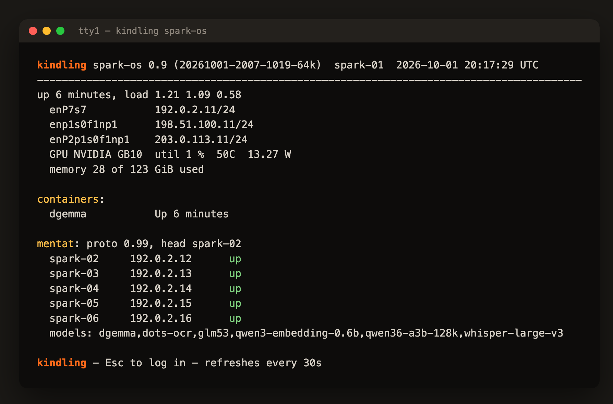

# kindling-spark-os

*Kindling Spark OS is in beta. Visit the discord for support https://discord.gg/M7XTrRJW3*

A minimal, read-only OS image for NVIDIA GB10 boxes (DGX Spark, ASUS Ascent GX10), installed beside
the box's DGX OS and booted from GRUB.

`kindling-spark-os` gets you an extra 4GB to run models: first, by using a 64kB kernel, and second,
by making use of GPU RAM that normally goes unused.

The image is an erofs file on the box's own root disk. At boot the initramfs mounts it under a RAM
overlay, copies the box's identity in (hostname, machine-id, ssh host keys, network config,
`/etc/spark`), and binds `/home`, `/srv`, `/var/log`, `/var/lib/docker`, `/var/lib/containerd`,
`/var/lib/spark-watchdog` and `/var/lib/nfs` from the root disk (`--mounts` adds more). At boot,
`sparkos-users` copies in the DGX OS install's login users (uid 1000 and up) and its
`/etc/sudoers.d`, so whoever logs in to DGX OS logs in here too, with the same password and keys.
Each user gets exactly its DGX OS group memberships, so the same rights, and a shell the image lacks
becomes `/bin/bash`. The image's own `admin` is only a fallback, dropped when DGX OS supplies its own
users. `/etc/subuid` and `/etc/subgid` are not copied. Every boot starts from the same
image. DGX OS stays installed as the rescue system and owns GRUB.

The image carries:

- the kernel and NVIDIA driver of one supported pair (`stacks.yaml`), Canonical-signed, so Secure
  Boot keeps working
- Docker and the NVIDIA container toolkit, RDMA and ConnectX tools, NVIDIA's DGX tuning packages
- `mentatd`, the [mentat](https://github.com/mmastrac/mentat) node daemon
- the [spark agent](https://github.com/mmastrac/spark-agent), which registers its MCP endpoint
  with mentat
- `dispramd`, which lends the GPU's 2 GiB display carveout to CUDA (see [dispram](#dispram))
- `spark-watchdog`, a host log snapshot for the agent, and a cluster status console on tty1

## Quick start

On the box, from DGX OS, in a checkout or unpacked download of this repository:

    ./setup.sh --check    # what is missing, changing nothing
    ./setup.sh            # build the setup image and install a trial image
    sudo systemctl reboot

`setup.sh` checks the box first: an arm64 GB10, UEFI boot, DGX OS (or a running spark-os), GRUB,
NVIDIA's apt keyrings, sudo, Docker, disk space, and the package and image hosts. It also warns
about what the new image will need at boot: a DGX OS user with an ssh key, `/etc/spark` settings,
and containers that would take the same ports. Before it changes anything, it asks whether you have
physical access to the box: a failed boot can need its HDMI output, a USB keyboard or a power cycle.
Then it builds the setup image and runs `kindling-setup install --trial`. It never reboots by
itself.

Every run is appended to `~/kindling-spark-os-setup.log`: the checks, your answers, and each change
to the box as a `change:` line with an `undo:` line beneath it, so a person or an agent can reverse
exactly what a run did. A file it overwrites is first copied to
`/var/lib/kindling-spark-os/backup/<time>/`.

After the reboot, check the box, then run `sparkos-promote` within 10 minutes to keep the image.
Otherwise it goes back to DGX OS on its own. `sparkos-rollback` goes back at any time.

## Supported stacks

Canonical builds each signed NVIDIA module package for one kernel ABI against exactly one driver
version, so a stack is that pair. `stacks.yaml` lists the pairs that have passed a trial boot, with
every `.deb`'s URL and sha256, and names a default. `tools/pin-stack.sh ABI DRIVER` writes a new
entry.

Ubuntu does not snapshot its ports archive, so an old pair's `.debs` can disappear from the mirror.
The setup image for a pair contains them, which makes each image tag an archive of its pair.

## Build the setup image

On an arm64 host with Docker (a box will do):

    tools/build-image.sh            # the default stack, tagged :<stack> (+ as -) and :latest
    tools/build-image.sh 7.0.0-1019+580.178.04

## Install on a box

From DGX OS:

    docker run --rm --privileged --network host -v /:/host kindling-spark-os install --trial

From a running spark-os, mount the DGX OS root disk instead:

    docker run --rm --privileged --network host -v /run/sparkos/host:/host kindling-spark-os install --trial

`install` builds the image (about 4 minutes), copies it to `/images/spark-os-VERSION.erofs` with its
kernel and initramfs in `/boot/sparkos/VERSION/`, and adds a GRUB entry. `--trial` makes that entry
the next boot, once. Reboot when ready.

Options:

- `--flavour nvidia-64k` (default; 64 KiB pages return about 2 GiB on a 128 GiB box, with THP off
  so `vm.min_free_kbytes` does not grow to 5% of RAM, but see the mmap warning below) or `nvidia`.
- `--version NAME`. The default is the release, kernel ABI and flavour, such as `0.9-1019-64k`, the
  same on every box, with `-2`, `-3`, ... when that name is already installed on the box.
- `--packages "P ..."`: extra packages, from Ubuntu, NVIDIA's repositories or a `--sources` file.
- `--sources FILE` (repeatable): an apt source on DGX OS, a `.list` or `.sources` file. The
  keyrings it names come from DGX OS as well.
- `--mounts "DIR ..."`: more directories to bind from the DGX OS disk. Recipes that keep weights or
  compose directories in `/var/tmp` want `--mounts /var/tmp`. System directories are refused.
- `--hostname-kindling`: under spark-os, name the box `kindling-XXXX`, where XXXX is the last four
  hex digits of its LAN port's MAC (NVIDIA names boxes `gx10-XXXX` the same way). DGX OS keeps its
  own hostname. It is recorded in `/etc/kindling-spark-os/hostname` on the DGX OS disk; delete that
  file to go back.
- `--connectx-mtu N`: the RoCE MTU for the ConnectX ports, default 4096 (`0` turns it off). RoCE
  runs at the largest IB MTU that fits in the Ethernet MTU less 88 bytes, so a port at the usual
  1500 runs RoCE at 1024. At boot, and whenever a link comes up, a ConnectX port too small for N is
  raised to N + 104 (4200 for 4096). A larger MTU, such as 9000, is left alone. The switch or peer
  on that link must accept the larger frames; `setup.sh --check` lists the ports it will raise.
- `--ethernet-mtu N`: an exact MTU for the onboard Ethernet ports. By default they keep DGX OS's
  setting.
- `--site DIR` (below).

`setup.sh` takes the same options. `list` shows the installed images and GRUB's state, and `stack`
shows the pair this setup image carries.

### Tailscale

On a box that runs Tailscale under DGX OS, install it in the image from the same apt source:

    ./setup.sh --sources /etc/apt/sources.list.d/tailscale.list --packages tailscale

The image binds `/var/lib/tailscale` from the DGX OS disk, so the box keeps its tailnet identity and
needs no new login. `setup.sh --check` points this out when DGX OS has Tailscale and the options do
not. Without it, a box reached only over the tailnet is unreachable on its trial boot and reverts.

### Swap

spark-os uses the DGX OS disk's swap: DGX OS makes a 16 GiB `/swap.img`, and without swap a model
load whose peak DGX OS absorbs gets OOM-killed. A swap header records its page size, so a 64k image
cannot use `/swap.img`. For a 64k image, `install` makes a parallel `/swap-64k.img` of the same size
on that disk, once. It skips this with a warning if less than 32 GiB would stay free
(`MIN_FREE_GIB`). At boot, `sparkos-swap` turns on whichever file matches the running page size.

### Warning: load model weights into ordinary memory on the 64k kernel

On the 64k kernel, a CUDA copy from a file-backed `mmap` to the GPU hangs. vLLM's default
safetensors loader does exactly that: it copies each tensor from a view of the memory-mapped
checkpoint. On spark-f1ff (driver 580.178.04), stock vLLM sat at shard 0 for over 13 minutes with
libcuda spin-waiting and the GPU idle. With the shards read into ordinary memory first, the same
model loaded in 1.4 s. The 4k kernel takes the same path at its usual, slower speed without hanging.

On the 64k flavour, start vLLM with `--safetensors-load-strategy eager`. Any other loader must copy
tensors into anonymous memory (for example `tensor.clone()`) before moving them to the GPU.

### Trial and promote

A new image boots in trial mode: `sparkos.trial panic=10` on the cmdline. A panic reboots. An
unconfirmed boot reboots 10 minutes after it starts. GRUB's one-shot entry is spent by then, so both
land back in DGX OS. To keep a trial running past 10 minutes without promoting it, run
`sudo touch /run/sparkos-confirmed`. That lasts for this boot only.

Once the image is good, run `sparkos-promote` on it. That confirms the boot, drops the trial flag,
and makes the image GRUB's default. It refuses if `update-grub` fails or the new entry still carries
the trial flag. DGX OS stays in the menu.

A promoted image still falls back by itself. Each spark-os entry calls GRUB's `recordfail` and
boots with `panic=30`, and `sparkos-boot-ok.service` clears the flag once the image reaches
multi-user. If a boot dies first, from a panic, a missing file, or a hang after spark-watchdog
starts, GRUB's next boot goes to DGX OS (entry 0) with no one at the console. A hard hang earlier
in boot still needs a power cycle, after which the same fallback applies.

### Rollback

`sparkos-rollback` makes DGX OS the default boot again and reboots, in one command.
`sparkos-rollback VERSION` goes back to an earlier installed image instead: as the default if it was
promoted, or as a one-shot trial if it was not. `--no-reboot` sets GRUB without rebooting. Both
cancel any queued one-shot boot and clear GRUB's recordfail flag. `install` puts the same command in
the DGX OS root, so it works from either OS.

`enter-dgx-os [COMMAND]` runs a shell or command in the DGX OS install from spark-os, in a private
mount namespace. Use it for anything the image leaves out: apt, update-grub, grub-reboot.

## Per-node settings

These live in `/etc/spark` on each box's own disk, and the initramfs copies them in:

- `node.env` for `mentatd`: `MENTAT_NODE_IP`, `MENTAT_PEERS`, `MENTAT_ANNOUNCE_IFACES`,
  `MENTAT_SECRET_FILE`. Without it `mentatd` does not start.
- `agent.env` for the spark agent: `MENTAT_ROUTER_URL` and `ALLOWED_SOURCES`. Without it the agent
  does not start.

Boxes moving over from the container deployments should stop the `mentatd` and `spark-agent`
containers (`docker update --restart=no` and `docker stop`). Otherwise they take the same ports.

## Site layer

Anything specific to one fleet goes in a site layer, so this repo carries no fleet addresses.
`install --site DIR`, or `/etc/kindling-spark-os/site` on the DGX OS root when it exists:

- `DIR/root/` is copied over the image (units, scripts, config)
- `DIR/packages.txt` lists extra packages
- `DIR/customize.d/*.sh` run inside the image after the base customize step, in order. Use them to
  enable the site's units and add `/etc/fstab` lines, such as more binds from `/run/sparkos/host`.

## Services

| Unit | What |
|---|---|
| `mentatd` | mentat node daemon (needs `/etc/spark/node.env`) |
| `spark-agent` | status page and MCP tools on :8090, runs as `spark-agent` with `CAP_SYS_PTRACE` only (needs `/etc/spark/agent.env`) |
| `dispramd` | display carveout lender, on the validated driver only |
| `spark-watchdog` | pets the SBSA watchdog while the box can still fork |
| `spark-dmesg-snapshot.timer` | writes dmesg, docker and systemd state to `/var/log/spark` for the agent each minute |
| `spark-console` | cluster status on tty1; Esc to log in |
| `sparkos-trial-revert.timer` | reverts an unconfirmed trial boot |

## dispram

`dispramd` lends the 2 GiB display carveout, which the driver never uses on GB10, to CUDA processes
as ordinary device memory. A patch for vLLM, and a plugin for stock images, put the tail of the KV
cache there. See [dispram/README.md](dispram/README.md). The server side is AGPL-3.0. The client,
vLLM plugin and patch are GPL-3.0 with a bundling exception, so they can ship inside vLLM or any image.

## Licensing

This repository is AGPL-3.0. The images it builds are collections of separately licensed packages,
and each keeps its own license:

- the Linux kernel: GPL-2.0. Source: Ubuntu's `linux-nvidia-7.0` and `linux-signed-nvidia-7.0`
  source packages for the stack's version.
- NVIDIA's open kernel modules: dual MIT/GPL-2.0. Source: `linux-restricted-modules-nvidia-7.0`,
  and [open-gpu-kernel-modules](https://github.com/NVIDIA/open-gpu-kernel-modules) at the driver's tag.
- NVIDIA's userspace driver and GSP firmware: NVIDIA's driver license. Section 1.1(d) of that
  license allows distributing them unmodified, with the license, for use with an open-source kernel.
  The license text is in each package's `copyright` file.
- NVIDIA's DGX tuning packages (`nvidia-spark-limits`, `nv-cpu-governor`, `nvidia-kernel-defaults`
  and others): proprietary, with no right to redistribute. The setup image does not carry them.
  `install` fetches them from NVIDIA's repository with the box's own apt keyring. A built image
  contains them, so do not publish one.
- `dispram/rmlist.c` compiles against NVIDIA's open-gpu-kernel-modules headers (MIT).
- Everything else comes from Ubuntu under its usual licenses.

## Credits

kindling-spark-os is made by the members of [kindlingai](https://github.com/kindlingai):

- [@mmastrac](https://github.com/mmastrac) (Matt Mastracci)
- [@coffee-the-dev](https://github.com/coffee-the-dev) (Steve)
- [@adapt-ai-systems](https://github.com/adapt-ai-systems)

Thanks to [@joesinvestments](https://github.com/joesinvestments) (Joey) for testing and lots of early
feedback.
